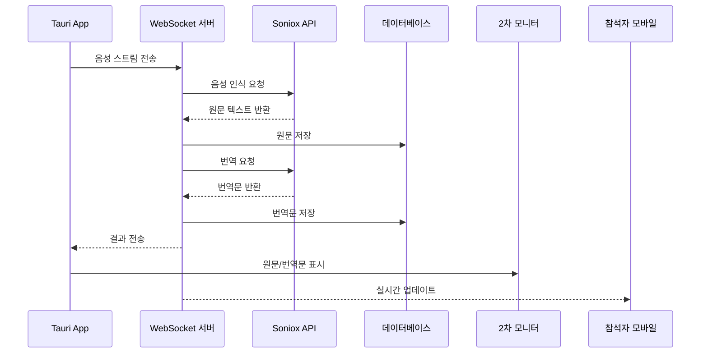

# Soniox 실시간 통역 시스템 - 종합 명세서

## 목차

1. [프로젝트 개요](#1-프로젝트-개요)
2. [시스템 아키텍처](#2-시스템-아키텍처)
3. [기술 스택](#3-기술-스택)
4. [데이터베이스 설계](#4-데이터베이스-설계)
5. [API 명세](#5-api-명세)
6. [UI/UX 설계](#6-uiux-설계)
7. [보안 및 데이터 관리](#7-보안-및-데이터-관리)
8. [개발 가이드](#8-개발-가이드)
9. [배포 가이드](#9-배포-가이드)
10. [테스트 전략](#10-테스트-전략)

---

## 1. 프로젝트 개요

### 1.1 시스템 소개

Soniox API를 활용한 실시간 통역 시스템입니다. 사용자는 웹에서 프로젝트를 생성하고, 전용 App을 통해 음성을 수음/송출합니다. 

### 1.2 주요 기능

- **실시간 음성 인식 및 번역** (Soniox API)
- **웹 기반 프로젝트 관리**
- **전용 App을 통한 수음/송출 제어**
- **2차 모니터 풀사이즈 표시** (A안)
- **QR 코드 기반 모바일 접속** (B안)
- **통역 내역 및 음성 파일 저장**
- **안전한 데이터 관리** (암호화, 키체인)

### 1.3 시스템 구성

#### 1.3.1 관리자 웹 (Admin Web)
- 로그인, API 키 등록, 프로젝트 생성 관리
- 기술: React + TypeScript + Vite

#### 1.3.2 참석자 웹 (Participant Web)
- QR 코드로 접속하여 통역 결과 실시간 조회
- 기술: React + TypeScript + Vite

#### 1.3.3 현장 앱 (Tauri App)
- 실제 통역 진행 (마이크 입력, 송출 제어, 2차 모니터)
- 기술: Tauri + React + Rust

#### 1.3.4 백엔드 서버
- REST API, WebSocket, 인증, 데이터 관리
- 기술: Node.js + Express + TypeScript


### 1.4 용어 정의

| 용어 | 설명 |
|------|------|
| **시스템** | Soniox 실시간 통역 시스템 전체 |
| **관리자** | 시스템에 로그인하여 API 키를 등록하고 프로젝트를 생성하는 사용자 |
| **참석자** | QR 코드로 접속하여 통역 결과를 보는 사용자 |
| **현장 운영자** | Tauri 앱을 사용하여 실제 통역을 진행하는 사용자 |
| **프로젝트** | 통역 세션을 관리하는 단위 |
| **A안** | App과 연결된 2차 모니터로 원문과 통역문을 풀사이즈로 표시하는 방식 |
| **B안** | 참석자가 QR 코드로 접속하여 스마트폰으로 통역 내역을 확인하는 방식 |
| **수음** | App에서 마이크를 통해 음성을 캡처하는 것 |
| **송출** | App에서 캡처한 음성을 서버로 전송하는 것 |
| **통역 내역** | 원문과 번역문을 포함한 통역 결과 |

### 1.5 프로젝트 상태

| 상태 | 아이콘 | 설명 |
|------|--------|------|
| 대기중 | ⏸️ | 프로젝트 생성 후 아직 실행되지 않은 상태 |
| 수신중 | 🎤 | App에서 수음 버튼을 눌러 음성을 캡처 중인 상태 |
| 송출중 | 📡 | App에서 송출 버튼을 눌러 서버로 음성을 전송 중인 상태 |
| 정지 | ⏹️ | 수음과 송출이 모두 일시 정지된 상태 (재실행 가능) |
| 종료 | 🔴 | 세션이 완전히 종료된 상태 (재실행 가능) |

---

## 2. 시스템 아키텍처

### 2.1 전체 아키텍처 다이어그램

```
┌─────────────────────────────────────────────────────────────────┐
│                         클라이언트 계층                          │
├─────────────────────────────────────────────────────────────────┤
│  ┌──────────────┐  ┌──────────────┐  ┌──────────────┐          │
│  │  관리자 웹   │  │  참석자 웹   │  │  Tauri App   │          │
│  │  (React)     │  │  (React)     │  │  (Rust+React)│          │
│  └──────┬───────┘  └──────┬───────┘  └──────┬───────┘          │
│         │                  │                  │                  │
│         └──────────────────┼──────────────────┘                  │
│                            │                                     │
└────────────────────────────┼─────────────────────────────────────┘
                             │
┌────────────────────────────┼─────────────────────────────────────┐
│                         백엔드 계층                              │
├────────────────────────────┼─────────────────────────────────────┤
│         ┌──────────────────┴──────────────────┐                 │
│         │      Express.js + Socket.io         │                 │
│         │  ┌──────────┐  ┌──────────────┐    │                 │
│         │  │ REST API │  │  WebSocket   │    │                 │
│         │  └────┬─────┘  └──────┬───────┘    │                 │
│         └───────┼────────────────┼────────────┘                 │
│                 │                │                               │
│         ┌───────┴────────────────┴────────┐                     │
│         │       비즈니스 로직 계층        │                     │
│         │  ┌────────┐  ┌────────────┐    │                     │
│         │  │ 인증   │  │ 프로젝트   │    │                     │
│         │  │ 서비스 │  │ 서비스     │    │                     │
│         │  └────────┘  └────────────┘    │                     │
│         │  ┌────────┐  ┌────────────┐    │                     │
│         │  │ 세션   │  │ 통역       │    │                     │
│         │  │ 서비스 │  │ 서비스     │    │                     │
│         │  └────────┘  └────────────┘    │                     │
│         └──────────────┬──────────────────┘                     │
└────────────────────────┼─────────────────────────────────────────┘
                         │
┌────────────────────────┼─────────────────────────────────────────┐
│                      데이터 계층                                 │
├────────────────────────┼─────────────────────────────────────────┤
│  ┌──────────────┐  ┌──┴───────────┐  ┌──────────────┐          │
│  │  PostgreSQL  │  │    Redis     │  │  파일 저장소 │          │
│  │  (주 DB)     │  │  (캐시)      │  │  (음성 파일) │          │
│  └──────────────┘  └──────────────┘  └──────────────┘          │
└─────────────────────────────────────────────────────────────────┘
                         │
┌────────────────────────┼─────────────────────────────────────────┐
│                      외부 서비스                                 │
├────────────────────────┼─────────────────────────────────────────┤
│         ┌──────────────┴──────────────┐                         │
│         │       Soniox API             │                         │
│         │  ┌──────────┐  ┌──────────┐ │                         │
│         │  │ 음성인식 │  │  번역    │ │                         │
│         │  └──────────┘  └──────────┘ │                         │
│         └─────────────────────────────┘                         │
└─────────────────────────────────────────────────────────────────┘
```


### 2.2 데이터 흐름

#### 2.2.1 통역 프로세스 흐름

```
1. 사용자 → 웹 로그인 → 인증 서비스 → 사용자 DB
2. 대시보드 → 프로젝트 생성 → 프로젝트 DB
3. 사용자 → App 로그인 → 인증 서비스 → 프로젝트 선택
4. 제어 패널 → 수신 버튼 → 음성 파형
5. 송출 버튼 → 세션 관리 → 음성 파일 저장소
6. Soniox 음성인식 → 원문
7. Soniox 번역 → 번역문 → 통역내역 DB
8. A안: 2차 모니터 / B안: WebSocket → 모바일 화면
```

#### 2.2.2 실시간 통신 흐름



---

## 3. 기술 스택

### 3.1 프론트엔드

| 구분 | 기술 | 버전 | 용도 |
|------|------|------|------|
| **프레임워크** | React | 18+ | UI 컴포넌트 |
| **언어** | TypeScript | 5+ | 타입 안정성 |
| **빌드 도구** | Vite | 5+ | 빠른 개발 환경 |
| **스타일링** | Tailwind CSS | 3+ | 유틸리티 CSS |
| **상태 관리** | Zustand | 4+ | 경량 상태 관리 |
| **HTTP 클라이언트** | Axios | 1+ | API 통신 |
| **실시간 통신** | Socket.io Client | 4+ | WebSocket |

### 3.2 백엔드

| 구분 | 기술 | 버전 | 용도 |
|------|------|------|------|
| **런타임** | Node.js | 18+ | 서버 실행 환경 |
| **프레임워크** | Express.js | 4+ | REST API |
| **언어** | TypeScript | 5+ | 타입 안정성 |
| **데이터베이스** | PostgreSQL | 14+ | 관계형 데이터 |
| **캐시** | Redis | 7+ | 세션 관리 |
| **실시간 통신** | Socket.io | 4+ | WebSocket 서버 |
| **인증** | JWT | 9+ | 무상태 인증 |
| **암호화** | crypto (Node.js) | - | AES-256 암호화 |
| **로깅** | Winston | 3+ | 구조화된 로깅 |

### 3.3 Tauri App

| 구분 | 기술 | 버전 | 용도 |
|------|------|------|------|
| **프레임워크** | Tauri | 2+ | 데스크톱 앱 |
| **언어 (백엔드)** | Rust | 1.70+ | 네이티브 기능 |
| **언어 (프론트)** | TypeScript | 5+ | UI 로직 |
| **데이터베이스** | SQLite + SQLCipher | - | 로컬 암호화 DB |
| **키체인** | keyring crate | - | OS 키체인 통합 |
| **HTTP 클라이언트** | reqwest | - | API 통신 |

### 3.4 외부 서비스

| 서비스 | 용도 |
|--------|------|
| **Soniox API** | 음성 인식 및 번역 |
| **AWS S3** (선택) | 음성 파일 저장 |

### 3.5 개발 도구

| 도구 | 용도 |
|------|------|
| **ESLint** | 코드 품질 검사 |
| **Prettier** | 코드 포맷팅 |
| **Jest** | 단위 테스트 |
| **fast-check** | 속성 기반 테스트 |
| **Playwright** | E2E 테스트 |

---

## 4. 데이터베이스 설계

### 4.1 ERD (Entity Relationship Diagram)

```
┌─────────────┐
│    users    │
│─────────────│
│ id (PK)     │
│ username    │
│ password_hash│
│ email       │
│ created_at  │
│ updated_at  │
└──────┬──────┘
       │ 1
       │
       │ N
┌──────┴──────────┐
│    projects     │
│─────────────────│
│ id (PK)         │
│ project_number  │
│ name            │
│ password        │
│ user_id (FK)    │
│ status          │
│ source_language │
│ target_language │
│ enable_option_a │
│ enable_option_b │
│ created_at      │
│ updated_at      │
└──────┬──────────┘
       │ 1
       │
       │ N
┌──────┴──────────┐
│    sessions     │
│─────────────────│
│ id (PK)         │
│ project_id (FK) │
│ status          │
│ started_at      │
│ ended_at        │
│ duration_seconds│
└──────┬──────────┘
       │ 1
       │
       ├─────────────────┐
       │ N               │ N
┌──────┴──────────────┐  │
│interpretation_records│  │
│─────────────────────│  │
│ id (PK)             │  │
│ session_id (FK)     │  │
│ original_text       │  │
│ translated_text     │  │
│ source_language     │  │
│ target_language     │  │
│ created_at          │  │
│ sequence_number     │  │
└─────────────────────┘  │
                         │
                ┌────────┴────────┐
                │  audio_files    │
                │─────────────────│
                │ id (PK)         │
                │ session_id (FK) │
                │ file_path       │
                │ file_name       │
                │ file_size       │
                │ duration_seconds│
                │ created_at      │
                └─────────────────┘
```


### 4.2 테이블 상세 설계

#### 4.2.1 users (사용자)

```sql
CREATE TABLE users (
    id UUID PRIMARY KEY DEFAULT gen_random_uuid(),
    username VARCHAR(50) UNIQUE NOT NULL,
    password_hash VARCHAR(255) NOT NULL,
    email VARCHAR(255),
    created_at TIMESTAMP DEFAULT CURRENT_TIMESTAMP,
    updated_at TIMESTAMP DEFAULT CURRENT_TIMESTAMP
);
```

| 컬럼 | 타입 | 제약 | 설명 |
|------|------|------|------|
| id | UUID | PK | 사용자 고유 식별자 |
| username | VARCHAR(50) | UNIQUE, NOT NULL | 사용자 아이디 |
| password_hash | VARCHAR(255) | NOT NULL | 비밀번호 해시 (bcrypt) |
| email | VARCHAR(255) | - | 이메일 주소 |
| created_at | TIMESTAMP | DEFAULT NOW | 생성 시간 |
| updated_at | TIMESTAMP | DEFAULT NOW | 수정 시간 |

#### 4.2.2 projects (프로젝트)

```sql
CREATE TABLE projects (
    id UUID PRIMARY KEY DEFAULT gen_random_uuid(),
    project_number VARCHAR(20) UNIQUE NOT NULL,
    name VARCHAR(100) NOT NULL,
    password VARCHAR(50) NOT NULL,
    user_id UUID NOT NULL REFERENCES users(id),
    status VARCHAR(20) DEFAULT 'waiting',
    source_language VARCHAR(10) NOT NULL,
    target_language VARCHAR(10) NOT NULL,
    enable_option_a BOOLEAN DEFAULT false,
    enable_option_b BOOLEAN DEFAULT false,
    created_at TIMESTAMP DEFAULT CURRENT_TIMESTAMP,
    updated_at TIMESTAMP DEFAULT CURRENT_TIMESTAMP
);
```

| 컬럼 | 타입 | 제약 | 설명 |
|------|------|------|------|
| id | UUID | PK | 프로젝트 고유 식별자 |
| project_number | VARCHAR(20) | UNIQUE, NOT NULL | 프로젝트 번호 (자동 생성) |
| name | VARCHAR(100) | NOT NULL | 프로젝트 이름 |
| password | VARCHAR(50) | NOT NULL | 참석자 접속용 비밀번호 |
| user_id | UUID | FK | 프로젝트 소유자 |
| status | VARCHAR(20) | DEFAULT 'waiting' | 프로젝트 상태 |
| source_language | VARCHAR(10) | NOT NULL | 소스 언어 (ko, en, ja, zh, es, any) |
| target_language | VARCHAR(10) | NOT NULL | 대상 언어 (ko, en, ja, zh, es) |
| enable_option_a | BOOLEAN | DEFAULT false | A안 활성화 |
| enable_option_b | BOOLEAN | DEFAULT false | B안 활성화 |
| created_at | TIMESTAMP | DEFAULT NOW | 생성 시간 |
| updated_at | TIMESTAMP | DEFAULT NOW | 수정 시간 |

**상태 값**: `waiting`, `receiving`, `streaming`, `paused`, `ended`

#### 4.2.3 sessions (세션)

```sql
CREATE TABLE sessions (
    id UUID PRIMARY KEY DEFAULT gen_random_uuid(),
    project_id UUID NOT NULL REFERENCES projects(id),
    status VARCHAR(20) DEFAULT 'active',
    started_at TIMESTAMP DEFAULT CURRENT_TIMESTAMP,
    ended_at TIMESTAMP,
    duration_seconds INTEGER DEFAULT 0
);
```

| 컬럼 | 타입 | 제약 | 설명 |
|------|------|------|------|
| id | UUID | PK | 세션 고유 식별자 |
| project_id | UUID | FK | 연결된 프로젝트 |
| status | VARCHAR(20) | DEFAULT 'active' | 세션 상태 |
| started_at | TIMESTAMP | DEFAULT NOW | 시작 시간 |
| ended_at | TIMESTAMP | - | 종료 시간 |
| duration_seconds | INTEGER | DEFAULT 0 | 실행 시간 (초) |

**상태 값**: `active`, `paused`, `ended`

#### 4.2.4 interpretation_records (통역 내역)

```sql
CREATE TABLE interpretation_records (
    id UUID PRIMARY KEY DEFAULT gen_random_uuid(),
    session_id UUID NOT NULL REFERENCES sessions(id),
    original_text TEXT NOT NULL,
    translated_text TEXT NOT NULL,
    source_language VARCHAR(10) NOT NULL,
    target_language VARCHAR(10) NOT NULL,
    created_at TIMESTAMP DEFAULT CURRENT_TIMESTAMP,
    sequence_number INTEGER NOT NULL
);
```

| 컬럼 | 타입 | 제약 | 설명 |
|------|------|------|------|
| id | UUID | PK | 통역 내역 고유 식별자 |
| session_id | UUID | FK | 연결된 세션 |
| original_text | TEXT | NOT NULL | 원문 텍스트 |
| translated_text | TEXT | NOT NULL | 번역문 텍스트 |
| source_language | VARCHAR(10) | NOT NULL | 소스 언어 |
| target_language | VARCHAR(10) | NOT NULL | 대상 언어 |
| created_at | TIMESTAMP | DEFAULT NOW | 생성 시간 |
| sequence_number | INTEGER | NOT NULL | 세션 내 순서 번호 |

#### 4.2.5 audio_files (음성 파일)

```sql
CREATE TABLE audio_files (
    id UUID PRIMARY KEY DEFAULT gen_random_uuid(),
    session_id UUID NOT NULL REFERENCES sessions(id),
    file_path VARCHAR(500) NOT NULL,
    file_name VARCHAR(255) NOT NULL,
    file_size INTEGER NOT NULL,
    duration_seconds INTEGER,
    created_at TIMESTAMP DEFAULT CURRENT_TIMESTAMP
);
```

| 컬럼 | 타입 | 제약 | 설명 |
|------|------|------|------|
| id | UUID | PK | 음성 파일 고유 식별자 |
| session_id | UUID | FK | 연결된 세션 |
| file_path | VARCHAR(500) | NOT NULL | 파일 저장 경로 |
| file_name | VARCHAR(255) | NOT NULL | 파일 이름 |
| file_size | INTEGER | NOT NULL | 파일 크기 (바이트) |
| duration_seconds | INTEGER | - | 음성 길이 (초) |
| created_at | TIMESTAMP | DEFAULT NOW | 생성 시간 |

#### 4.2.6 user_settings (사용자 설정)

```sql
CREATE TABLE user_settings (
    id INTEGER PRIMARY KEY AUTOINCREMENT,
    user_id INTEGER NOT NULL,
    setting_key TEXT NOT NULL,
    setting_value TEXT NOT NULL,  -- 암호화된 값
    created_at DATETIME DEFAULT CURRENT_TIMESTAMP,
    updated_at DATETIME DEFAULT CURRENT_TIMESTAMP,
    FOREIGN KEY (user_id) REFERENCES users(id),
    UNIQUE(user_id, setting_key)
);
```

| 컬럼 | 타입 | 제약 | 설명 |
|------|------|------|------|
| id | INTEGER | PK | 설정 고유 식별자 |
| user_id | INTEGER | FK | 사용자 ID |
| setting_key | TEXT | NOT NULL | 설정 키 (예: soniox_api_key) |
| setting_value | TEXT | NOT NULL | 암호화된 설정 값 |
| created_at | DATETIME | DEFAULT NOW | 생성 시간 |
| updated_at | DATETIME | DEFAULT NOW | 수정 시간 |

#### 4.2.7 audit_logs (감사 로그)

```sql
CREATE TABLE audit_logs (
    id INTEGER PRIMARY KEY AUTOINCREMENT,
    action TEXT NOT NULL,
    resource TEXT NOT NULL,
    user_id INTEGER NOT NULL,
    details TEXT,  -- 암호화된 JSON
    ip_address TEXT,
    timestamp DATETIME DEFAULT CURRENT_TIMESTAMP,
    FOREIGN KEY (user_id) REFERENCES users(id)
);
```

| 컬럼 | 타입 | 제약 | 설명 |
|------|------|------|------|
| id | INTEGER | PK | 로그 고유 식별자 |
| action | TEXT | NOT NULL | 작업 타입 |
| resource | TEXT | NOT NULL | 리소스 타입 |
| user_id | INTEGER | FK | 사용자 ID |
| details | TEXT | - | 암호화된 상세 정보 (JSON) |
| ip_address | TEXT | - | IP 주소 |
| timestamp | DATETIME | DEFAULT NOW | 시간 |

**액션 타입**: `api_key_read`, `api_key_write`, `api_key_delete`, `login`, `logout`

### 4.3 인덱스 설계

```sql
-- 프로젝트 테이블
CREATE INDEX idx_projects_user_id ON projects(user_id);
CREATE INDEX idx_projects_status ON projects(status);
CREATE INDEX idx_projects_created_at ON projects(created_at DESC);

-- 세션 테이블
CREATE INDEX idx_sessions_project_id ON sessions(project_id);
CREATE INDEX idx_sessions_status ON sessions(status);
CREATE INDEX idx_sessions_started_at ON sessions(started_at DESC);

-- 통역 내역 테이블
CREATE INDEX idx_interpretation_records_session_id ON interpretation_records(session_id);
CREATE INDEX idx_interpretation_records_created_at ON interpretation_records(created_at);
CREATE INDEX idx_interpretation_records_sequence ON interpretation_records(session_id, sequence_number);

-- 음성 파일 테이블
CREATE INDEX idx_audio_files_session_id ON audio_files(session_id);

-- 감사 로그 테이블
CREATE INDEX idx_audit_logs_user_id ON audit_logs(user_id);
CREATE INDEX idx_audit_logs_timestamp ON audit_logs(timestamp);
CREATE INDEX idx_audit_logs_action ON audit_logs(action);
```


---

## 5. API 명세

### 5.1 인증 API

#### 5.1.1 로그인

**POST** `/api/auth/login`

**요청**:
```json
{
  "username": "admin",
  "password": "test1234"
}
```

**응답** (200 OK):
```json
{
  "accessToken": "eyJhbGciOiJIUzI1NiIsInR5cCI6IkpXVCJ9...",
  "refreshToken": "eyJhbGciOiJIUzI1NiIsInR5cCI6IkpXVCJ9...",
  "expiresIn": 3600
}
```

#### 5.1.2 토큰 갱신

**POST** `/api/auth/refresh`

**요청**:
```json
{
  "refreshToken": "eyJhbGciOiJIUzI1NiIsInR5cCI6IkpXVCJ9..."
}
```

**응답** (200 OK):
```json
{
  "accessToken": "eyJhbGciOiJIUzI1NiIsInR5cCI6IkpXVCJ9...",
  "expiresIn": 3600
}
```

#### 5.1.3 로그아웃

**POST** `/api/auth/logout`

**요청**:
```json
{
  "refreshToken": "eyJhbGciOiJIUzI1NiIsInR5cCI6IkpXVCJ9..."
}
```

**응답** (200 OK):
```json
{
  "success": true
}
```

#### 5.1.4 토큰 검증

**GET** `/api/auth/verify`

**헤더**:
```
Authorization: Bearer <accessToken>
```

**응답** (200 OK):
```json
{
  "valid": true,
  "userId": "uuid",
  "username": "admin"
}
```

### 5.2 프로젝트 API

#### 5.2.1 프로젝트 생성

**POST** `/api/projects`

**요청**:
```json
{
  "name": "2024 국제 회의",
  "sourceLanguage": "ko",
  "targetLanguage": "en",
  "enableOptionA": true,
  "enableOptionB": true
}
```

**응답** (201 Created):
```json
{
  "id": "uuid",
  "projectNumber": "PRJ-20240128-001",
  "name": "2024 국제 회의",
  "password": "abcd1234",
  "status": "waiting",
  "sourceLanguage": "ko",
  "targetLanguage": "en",
  "enableOptionA": true,
  "enableOptionB": true,
  "createdAt": "2024-01-28T10:00:00Z"
}
```

#### 5.2.2 프로젝트 목록 조회

**GET** `/api/projects`

**쿼리 파라미터**:
- `page`: 페이지 번호 (기본값: 1)
- `limit`: 페이지 크기 (기본값: 20)
- `status`: 상태 필터 (선택)

**응답** (200 OK):
```json
{
  "projects": [
    {
      "id": "uuid",
      "projectNumber": "PRJ-20240128-001",
      "name": "2024 국제 회의",
      "status": "streaming",
      "sourceLanguage": "ko",
      "targetLanguage": "en",
      "createdAt": "2024-01-28T10:00:00Z"
    }
  ],
  "total": 50,
  "page": 1,
  "totalPages": 3
}
```

#### 5.2.3 프로젝트 상세 조회

**GET** `/api/projects/:id`

**응답** (200 OK):
```json
{
  "id": "uuid",
  "projectNumber": "PRJ-20240128-001",
  "name": "2024 국제 회의",
  "password": "abcd1234",
  "status": "streaming",
  "sourceLanguage": "ko",
  "targetLanguage": "en",
  "enableOptionA": true,
  "enableOptionB": true,
  "createdAt": "2024-01-28T10:00:00Z",
  "updatedAt": "2024-01-28T11:00:00Z",
  "currentSession": {
    "id": "uuid",
    "startedAt": "2024-01-28T11:00:00Z",
    "durationSeconds": 3600
  }
}
```

#### 5.2.4 프로젝트 상태 변경

**PATCH** `/api/projects/:id/status`

**요청**:
```json
{
  "status": "paused"
}
```

**응답** (200 OK):
```json
{
  "id": "uuid",
  "status": "paused",
  "updatedAt": "2024-01-28T12:00:00Z"
}
```

#### 5.2.5 QR 코드 조회

**GET** `/api/projects/:id/qrcode`

**응답** (200 OK):
```json
{
  "qrCodeUrl": "data:image/png;base64,iVBORw0KGgoAAAANSUhEUgAA...",
  "accessUrl": "https://app.example.com/participant/join?project=PRJ-20240128-001"
}
```

### 5.3 세션 API

#### 5.3.1 세션 시작

**POST** `/api/projects/:projectId/sessions`

**응답** (201 Created):
```json
{
  "id": "uuid",
  "projectId": "uuid",
  "status": "active",
  "startedAt": "2024-01-28T11:00:00Z"
}
```

#### 5.3.2 세션 종료

**POST** `/api/sessions/:id/end`

**응답** (200 OK):
```json
{
  "id": "uuid",
  "status": "ended",
  "endedAt": "2024-01-28T12:00:00Z",
  "durationSeconds": 3600
}
```

### 5.4 통역 내역 API

#### 5.4.1 세션 통역 내역 조회

**GET** `/api/sessions/:sessionId/interpretations`

**쿼리 파라미터**:
- `page`: 페이지 번호 (기본값: 1)
- `limit`: 페이지 크기 (기본값: 50)

**응답** (200 OK):
```json
{
  "interpretations": [
    {
      "id": "uuid",
      "originalText": "안녕하세요",
      "translatedText": "Hello",
      "sourceLanguage": "ko",
      "targetLanguage": "en",
      "createdAt": "2024-01-28T11:05:00Z",
      "sequenceNumber": 1
    }
  ],
  "total": 100,
  "page": 1,
  "totalPages": 2
}
```

### 5.5 설정 API

#### 5.5.1 API 키 저장

**POST** `/api/settings/api-key`

**요청**:
```json
{
  "apiKey": "sk_1234567890abcdef"
}
```

**응답** (200 OK):
```json
{
  "success": true,
  "message": "API 키가 저장되었습니다"
}
```

#### 5.5.2 API 키 상태 확인

**GET** `/api/settings/api-key`

**응답** (200 OK):
```json
{
  "exists": true,
  "maskedKey": "sk_***"
}
```

#### 5.5.3 API 키 삭제

**DELETE** `/api/settings/api-key`

**응답** (200 OK):
```json
{
  "success": true,
  "message": "API 키가 삭제되었습니다"
}
```

### 5.6 WebSocket 이벤트

#### 5.6.1 클라이언트 → 서버 이벤트

| 이벤트 | 데이터 | 설명 |
|--------|--------|------|
| `audio:stream` | `{ audioData: Buffer, sessionId: string }` | 음성 스트림 전송 |
| `project:join` | `{ projectId: string, password?: string }` | 프로젝트 참여 |
| `project:leave` | `{ projectId: string }` | 프로젝트 나가기 |
| `session:start` | `{ projectId: string }` | 세션 시작 |
| `session:pause` | `{ sessionId: string }` | 세션 일시정지 |
| `session:resume` | `{ sessionId: string }` | 세션 재개 |
| `session:end` | `{ sessionId: string }` | 세션 종료 |

#### 5.6.2 서버 → 클라이언트 이벤트

| 이벤트 | 데이터 | 설명 |
|--------|--------|------|
| `interpretation:result` | `InterpretationResult` | 통역 결과 |
| `project:status` | `{ status: string }` | 프로젝트 상태 변경 |
| `session:status` | `{ status: string }` | 세션 상태 변경 |
| `error` | `{ code: string, message: string }` | 오류 발생 |
| `participant:kicked` | `{}` | 참석자 강제 퇴장 |

**InterpretationResult 타입**:
```typescript
{
  sessionId: string;
  originalText: string;
  translatedText: string;
  sourceLanguage: string;
  targetLanguage: string;
  timestamp: string;
  sequenceNumber: number;
}
```

### 5.7 오류 코드

| 코드 | 메시지 | HTTP 상태 |
|------|--------|-----------|
| AUTH_001 | 아이디 또는 비밀번호가 올바르지 않습니다 | 401 |
| AUTH_002 | 인증 정보가 만료되었습니다 | 401 |
| AUTH_003 | 접근 권한이 없습니다 | 403 |
| PROJECT_001 | 프로젝트를 찾을 수 없습니다 | 404 |
| PROJECT_002 | 프로젝트 생성에 실패했습니다 | 500 |
| PROJECT_003 | 프로젝트 비밀번호가 올바르지 않습니다 | 401 |
| PROJECT_004 | 너무 많은 시도로 인해 접속이 차단되었습니다 | 429 |
| SESSION_001 | 세션을 시작할 수 없습니다 | 500 |
| SESSION_002 | 세션이 이미 종료되었습니다 | 400 |
| SONIOX_001 | 음성 인식 서비스에 연결할 수 없습니다 | 503 |
| SONIOX_002 | 번역 서비스에 연결할 수 없습니다 | 503 |
| LANG_001 | 지원하지 않는 언어입니다 | 400 |
| FILE_001 | 파일을 찾을 수 없습니다 | 404 |
| FILE_002 | 파일 저장에 실패했습니다 | 500 |
| DB_001 | 데이터베이스 오류가 발생했습니다 | 500 |


---

## 6. UI/UX 설계

### 6.1 관리자 웹 화면 구성

#### 6.1.1 로그인 페이지
- **경로**: `/login`
- **구성 요소**:
  - 로고
  - 아이디 입력 필드
  - 비밀번호 입력 필드
  - 로그인 버튼
  - 오류 메시지 표시 영역

#### 6.1.2 대시보드
- **경로**: `/dashboard`
- **구성 요소**:
  - 상단 네비게이션 (로고, 메뉴, 로그아웃)
  - 통계 카드 (총 프로젝트 수, 진행 중인 프로젝트, 완료된 프로젝트)
  - 최근 프로젝트 목록
  - 빠른 작업 버튼 (새 프로젝트 생성)

#### 6.1.3 프로젝트 목록 페이지
- **경로**: `/projects`
- **구성 요소**:
  - 검색 및 필터 (상태별, 날짜별)
  - 프로젝트 카드 목록
    - 프로젝트 번호
    - 프로젝트 이름
    - 상태 아이콘 (⏸️ 🎤 📡 ⏹️ 🔴)
    - 생성 날짜
    - 액션 버튼 (상세 보기, 삭제)
  - 페이지네이션
  - 새 프로젝트 생성 버튼

#### 6.1.4 프로젝트 생성 페이지
- **경로**: `/projects/create`
- **구성 요소**:
  - 프로젝트 이름 입력
  - 소스 언어 선택 (ko, en, ja, zh, es, any)
  - 대상 언어 선택 (ko, en, ja, zh, es)
  - A안 활성화 체크박스
  - B안 활성화 체크박스
  - 생성 버튼
  - 취소 버튼

#### 6.1.5 프로젝트 상세 페이지
- **경로**: `/projects/:id`
- **구성 요소**:
  - 프로젝트 정보 카드
    - 프로젝트 번호
    - 프로젝트 이름
    - 상태
    - 소스/대상 언어
    - 생성 날짜
    - 실행 시간
  - QR 코드 (B안 활성화 시)
  - 참석자 비밀번호 표시
  - 통역 내역 목록
    - 원문
    - 번역문
    - 시간
  - 음성 파일 목록
    - 파일 이름
    - 재생 버튼
    - 다운로드 버튼
  - 프로젝트 제어 버튼 (정지, 종료)

#### 6.1.6 설정 페이지
- **경로**: `/settings`
- **구성 요소**:
  - Soniox API 키 입력 필드
  - API 키 저장 버튼
  - API 키 삭제 버튼
  - API 키 상태 표시 (🟢 설정됨 / 🔴 미설정)

### 6.2 참석자 웹 화면 구성

#### 6.2.1 참석자 로그인 페이지
- **경로**: `/participant/join`
- **구성 요소**:
  - 프로젝트 번호 표시 (QR 코드에서 자동 입력)
  - 비밀번호 입력 필드
  - 접속 버튼
  - 오류 메시지 표시 영역

#### 6.2.2 참석자 실시간 통역 페이지
- **경로**: `/participant/live`
- **구성 요소**:
  - 프로젝트 이름 표시
  - 실시간 통역 내역 (자동 스크롤)
    - 원문 (큰 글씨)
    - 번역문 (큰 글씨)
    - 시간
  - 연결 상태 표시
  - 나가기 버튼

### 6.3 Tauri App 화면 구성

#### 6.3.1 로그인 페이지
- **구성 요소**:
  - 로고
  - 아이디 입력 필드
  - 비밀번호 입력 필드
  - 자동 로그인 체크박스
  - 로그인 버튼
  - 오류 메시지 표시 영역

#### 6.3.2 프로젝트 선택 페이지
- **구성 요소**:
  - 프로젝트 목록 (카드 형식)
    - 프로젝트 번호
    - 프로젝트 이름
    - 상태 아이콘
    - 선택 버튼
  - 새로고침 버튼
  - 로그아웃 버튼

#### 6.3.3 제어 패널 페이지
- **구성 요소**:
  - 상단 정보 영역
    - 프로젝트 이름
    - 실행 시간 (00:00:00)
    - 상태 아이콘
    - API 키 상태 인디케이터 (🟢/🔴)
  - 음성 파형 인디케이터
  - 제어 버튼 영역
    - 수신 버튼 (🎤)
    - 송출 버튼 (📡)
    - 송출정지 버튼
    - 정지 버튼 (⏹️)
    - 종료 버튼 (🔴)
  - 모니터 선택 드롭다운 (A안 활성화 시)
  - 오류 메시지 표시 영역
  - 프로젝트 변경 버튼

#### 6.3.4 2차 모니터 창 (A안)
- **구성 요소**:
  - 검정 배경
  - 원문 표시 (상단, 흰색 큰 글씨)
  - 번역문 표시 (하단, 흰색 큰 글씨)
  - 자동 줄바꿈
  - 실시간 업데이트

### 6.4 디자인 시스템

#### 6.4.1 색상 팔레트

| 용도 | 색상 | Hex |
|------|------|-----|
| Primary | 파란색 | #3B82F6 |
| Success | 초록색 | #10B981 |
| Warning | 노란색 | #F59E0B |
| Error | 빨간색 | #EF4444 |
| Background | 어두운 회색 | #1F2937 |
| Surface | 회색 | #374151 |
| Text Primary | 흰색 | #FFFFFF |
| Text Secondary | 밝은 회색 | #D1D5DB |

#### 6.4.2 타이포그래피

| 요소 | 폰트 크기 | 폰트 굵기 |
|------|-----------|-----------|
| Heading 1 | 2.25rem (36px) | Bold (700) |
| Heading 2 | 1.875rem (30px) | Bold (700) |
| Heading 3 | 1.5rem (24px) | Semibold (600) |
| Body | 1rem (16px) | Regular (400) |
| Small | 0.875rem (14px) | Regular (400) |
| Caption | 0.75rem (12px) | Regular (400) |

#### 6.4.3 간격 시스템

| 크기 | 값 |
|------|-----|
| xs | 0.25rem (4px) |
| sm | 0.5rem (8px) |
| md | 1rem (16px) |
| lg | 1.5rem (24px) |
| xl | 2rem (32px) |
| 2xl | 3rem (48px) |

#### 6.4.4 컴포넌트 스타일

**버튼**:
- Primary: 파란색 배경, 흰색 텍스트, 호버 시 어두워짐
- Secondary: 회색 배경, 흰색 텍스트, 호버 시 어두워짐
- Danger: 빨간색 배경, 흰색 텍스트, 호버 시 어두워짐
- 높이: 2.5rem (40px)
- 패딩: 1rem (16px) 좌우
- 둥근 모서리: 0.375rem (6px)

**입력 필드**:
- 배경: 어두운 회색
- 테두리: 밝은 회색
- 포커스 시: 파란색 테두리
- 높이: 2.5rem (40px)
- 패딩: 0.75rem (12px)
- 둥근 모서리: 0.375rem (6px)

**카드**:
- 배경: 회색
- 그림자: 약간의 그림자
- 패딩: 1.5rem (24px)
- 둥근 모서리: 0.5rem (8px)

### 6.5 반응형 디자인

#### 6.5.1 브레이크포인트

| 크기 | 최소 너비 | 설명 |
|------|-----------|------|
| sm | 640px | 모바일 (가로) |
| md | 768px | 태블릿 |
| lg | 1024px | 데스크톱 |
| xl | 1280px | 큰 데스크톱 |

#### 6.5.2 모바일 최적화 (참석자 웹)

- 터치 친화적인 버튼 크기 (최소 44x44px)
- 큰 글씨 (최소 16px)
- 세로 스크롤 최적화
- 자동 줄바꿈
- 간단한 네비게이션


---

## 7. 보안 및 데이터 관리

### 7.1 백엔드 보안

#### 7.1.1 API 키 암호화

**암호화 방식**: AES-256-GCM

**프로세스**:
1. 환경 변수 `ENCRYPTION_KEY`에서 32바이트 hex 문자열 로드
2. 각 암호화마다 16바이트 랜덤 IV 생성
3. AES-256-GCM으로 평문 암호화
4. `IV:AuthTag:EncryptedData` 형식으로 Base64 인코딩하여 저장

**구현 예시**:
```typescript
import crypto from 'crypto';

class EncryptionService {
  private readonly algorithm = 'aes-256-gcm';
  private encryptionKey: Buffer;

  constructor() {
    const keyHex = process.env.ENCRYPTION_KEY;
    if (!keyHex || keyHex.length !== 64) {
      throw new Error('ENCRYPTION_KEY must be 32 bytes (64 hex characters)');
    }
    this.encryptionKey = Buffer.from(keyHex, 'hex');
  }

  encrypt(plaintext: string): string {
    const iv = crypto.randomBytes(16);
    const cipher = crypto.createCipheriv(this.algorithm, this.encryptionKey, iv);
    
    let encrypted = cipher.update(plaintext, 'utf8');
    encrypted = Buffer.concat([encrypted, cipher.final()]);
    
    const authTag = cipher.getAuthTag();
    
    return [
      iv.toString('base64'),
      authTag.toString('base64'),
      encrypted.toString('base64')
    ].join(':');
  }

  decrypt(ciphertext: string): string {
    const parts = ciphertext.split(':');
    const iv = Buffer.from(parts[0], 'base64');
    const authTag = Buffer.from(parts[1], 'base64');
    const encrypted = Buffer.from(parts[2], 'base64');
    
    const decipher = crypto.createDecipheriv(this.algorithm, this.encryptionKey, iv);
    decipher.setAuthTag(authTag);
    
    let decrypted = decipher.update(encrypted);
    decrypted = Buffer.concat([decrypted, decipher.final()]);
    
    return decrypted.toString('utf8');
  }
}
```

#### 7.1.2 JWT 토큰 관리

**액세스 토큰**:
- 유효기간: 1시간
- 페이로드: `{ userId, username, iat, exp }`

**리프레시 토큰**:
- 유효기간: 7일
- SHA-256 해시로 데이터베이스에 저장
- 사용자당 최대 5개 활성 세션

**자동 정리**:
- 매일 자정에 만료된 토큰 삭제 (cron job)

#### 7.1.3 감사 로깅

**기록 대상**:
- API 키 조회/저장/삭제
- 로그인/로그아웃
- 프로젝트 생성/수정/삭제

**로그 형식**:
```typescript
{
  action: 'api_key_read',
  resource: 'user_settings',
  userId: 'uuid',
  details: { /* 암호화된 JSON */ },
  ipAddress: '192.168.1.1',
  timestamp: '2024-01-28T10:00:00Z'
}
```

**비정상 패턴 감지**:
- 1시간 내 API 키 조회 5회 이상
- 동일 IP에서 로그인 실패 10회 이상
- 감지 시 관리자에게 이메일 알림

**보관 기간**: 90일

### 7.2 Tauri App 보안

#### 7.2.1 SQLCipher 데이터베이스 암호화

**암호화 설정**:
```rust
PRAGMA key = 'encryption-key-from-keychain';
PRAGMA cipher_page_size = 4096;
PRAGMA kdf_iter = 256000;
PRAGMA cipher_hmac_algorithm = HMAC_SHA512;
PRAGMA cipher_kdf_algorithm = PBKDF2_HMAC_SHA512;
```

**암호화 키 관리**:
1. 앱 최초 실행 시 32바이트 랜덤 키 생성
2. OS 키체인에 `db-encryption-key`로 저장
3. 데이터베이스 열 때마다 키체인에서 조회

#### 7.2.2 OS 키체인 통합

**저장 항목**:
- `access-token`: 백엔드 액세스 토큰
- `refresh-token`: 백엔드 리프레시 토큰
- `user-id`: 사용자 ID (자동 로그인용)
- `db-encryption-key`: 데이터베이스 암호화 키

**서비스 이름**: `com.soniox.interpretation-app`

**플랫폼별 구현**:
- macOS: Keychain Services
- Windows: Credential Manager

**구현 예시**:
```rust
use keyring::Entry;

pub struct KeychainManager {
    service_name: String,
}

impl KeychainManager {
    pub fn new() -> Self {
        Self {
            service_name: "com.soniox.interpretation-app".to_string(),
        }
    }
    
    pub fn set(&self, key: &str, value: &str) -> Result<(), keyring::Error> {
        let entry = Entry::new(&self.service_name, key)?;
        entry.set_password(value)
    }
    
    pub fn get(&self, key: &str) -> Result<String, keyring::Error> {
        let entry = Entry::new(&self.service_name, key)?;
        entry.get_password()
    }
    
    pub fn delete(&self, key: &str) -> Result<(), keyring::Error> {
        let entry = Entry::new(&self.service_name, key)?;
        entry.delete_password()
    }
}
```

#### 7.2.3 Outbox 패턴

**목적**: 네트워크 장애 시에도 데이터 손실 방지

**테이블 구조**:
```sql
CREATE TABLE outbox_events (
  id INTEGER PRIMARY KEY AUTOINCREMENT,
  event_type TEXT NOT NULL,
  payload TEXT NOT NULL,
  status TEXT NOT NULL DEFAULT 'pending',
  retry_count INTEGER NOT NULL DEFAULT 0,
  created_at DATETIME DEFAULT CURRENT_TIMESTAMP,
  processed_at DATETIME
);
```

**프로세스**:
1. 비즈니스 데이터와 Outbox 이벤트를 동일 트랜잭션에 저장
2. 백그라운드 워커가 5초마다 pending 이벤트 폴링
3. 서버로 전송 시도
4. 성공 시 `completed`, 실패 시 `retry_count` 증가
5. 5회 실패 시 `failed` 상태로 변경하고 사용자에게 알림

**정리**: 7일 이상 된 completed 이벤트 자동 삭제

#### 7.2.4 트랜잭션 관리

**격리 수준**: SERIALIZABLE

**타임아웃**: 30초

**예시**:
```rust
pub fn start_session_with_outbox(
    conn: &Connection,
    project_id: &str,
    user_id: &str,
) -> Result<i64> {
    let tx = conn.transaction()?;
    
    // 1. 비즈니스 데이터 저장
    tx.execute(
        "INSERT INTO sessions (project_id, user_id, status) VALUES (?1, ?2, 'active')",
        params![project_id, user_id],
    )?;
    let session_id = tx.last_insert_rowid();
    
    // 2. Outbox 이벤트 저장
    let event = serde_json::json!({
        "session_id": session_id,
        "project_id": project_id,
        "user_id": user_id,
        "timestamp": chrono::Utc::now().timestamp(),
    });
    
    tx.execute(
        "INSERT INTO outbox_events (event_type, payload, status) VALUES (?1, ?2, 'pending')",
        params!["session_start", event.to_string()],
    )?;
    
    // 3. 트랜잭션 커밋
    tx.commit()?;
    
    Ok(session_id)
}
```

### 7.3 참석자 웹 보안

#### 7.3.1 세션 관리

**저장소**: sessionStorage (localStorage 사용 금지)

**저장 데이터**:
```typescript
{
  projectId: string;
  authenticated: boolean;
  connectedAt: number;
}
```

**보안 특징**:
- 브라우저 닫으면 자동 세션 종료
- 탭 간 세션 공유 안 됨
- XSS 공격 방지

#### 7.3.2 IP 차단

**규칙**:
- 비밀번호 3회 연속 실패 시 해당 IP 5분간 차단
- `participant_connections` 테이블에 기록

**구현**:
```typescript
async function checkIpBlocked(projectId: string, ipAddress: string): Promise<boolean> {
  const connection = await db.query(
    'SELECT blocked_until FROM participant_connections WHERE project_id = ? AND ip_address = ?',
    [projectId, ipAddress]
  );
  
  if (connection && connection.blocked_until) {
    const now = new Date();
    const blockedUntil = new Date(connection.blocked_until);
    return now < blockedUntil;
  }
  
  return false;
}
```

### 7.4 로깅 및 모니터링

#### 7.4.1 로그 레벨

| 레벨 | 용도 |
|------|------|
| ERROR | 치명적 오류 |
| WARN | 경고 (복구 가능) |
| INFO | 일반 정보 |
| DEBUG | 디버깅 정보 |

#### 7.4.2 민감 정보 마스킹

**마스킹 대상**:
- API 키: `sk_***`
- 토큰: `token_***`
- 비밀번호: 절대 로깅 안 함

**구현**:
```typescript
function maskSensitiveData(data: any): any {
  if (typeof data === 'string') {
    if (data.startsWith('sk_')) {
      return 'sk_***';
    }
    if (data.startsWith('eyJ')) { // JWT
      return 'token_***';
    }
  }
  return data;
}
```

#### 7.4.3 로그 파일 관리

**백엔드**:
- 경로: `backend/logs/`
- 파일: `application-YYYY-MM-DD.log`, `error-YYYY-MM-DD.log`
- 로테이션: 일별
- 보관: 30일

**Tauri App**:
- 경로: `~/.soniox-interpretation/logs/`
- 파일: `app.log`
- 로테이션: 일별
- 보관: 30일


---

## 8. 개발 가이드

### 8.1 개발 환경 설정

#### 8.1.1 필수 도구

| 도구 | 버전 | 설치 방법 |
|------|------|-----------|
| Node.js | 18+ | https://nodejs.org/ |
| npm | 9+ | Node.js와 함께 설치됨 |
| PostgreSQL | 14+ | https://www.postgresql.org/ |
| Redis | 7+ | https://redis.io/ |
| Rust | 1.70+ | https://rustup.rs/ |
| Tauri CLI | 2+ | `cargo install tauri-cli` |

#### 8.1.2 프로젝트 클론 및 설치

```bash
# 프로젝트 클론
git clone <repository-url>
cd soniox-interpretation-system

# 백엔드 설치
cd backend
npm install

# 관리자 웹 설치
cd ../web
npm install

# Tauri 앱 설치
cd ../tauri-app
npm install
```

#### 8.1.3 환경 변수 설정

**백엔드** (`.env`):
```env
# 서버 설정
PORT=3000
NODE_ENV=development

# 데이터베이스
DB_HOST=localhost
DB_PORT=5432
DB_NAME=soniox_interpretation
DB_USER=postgres
DB_PASSWORD=your_password

# Redis
REDIS_HOST=localhost
REDIS_PORT=6379

# JWT
JWT_SECRET=your_jwt_secret_key_here
JWT_EXPIRES_IN=1h
REFRESH_TOKEN_EXPIRES_IN=7d

# 암호화
ENCRYPTION_KEY=your_32_byte_hex_key_here

# Soniox API
SONIOX_API_KEY=sk_your_soniox_api_key

# 파일 저장소
STORAGE_TYPE=local
STORAGE_PATH=./uploads

# CORS
CORS_ORIGIN=http://localhost:5173,http://localhost:1420
```

**관리자 웹** (`.env`):
```env
VITE_API_URL=http://localhost:3000
VITE_WS_URL=ws://localhost:3000
```

**Tauri 앱** (`.env`):
```env
VITE_API_URL=http://localhost:3000
VITE_WS_URL=ws://localhost:3000
```

#### 8.1.4 데이터베이스 초기화

```bash
cd backend

# PostgreSQL 데이터베이스 생성
createdb soniox_interpretation

# 마이그레이션 실행
npm run db:migrate

# 시드 데이터 삽입 (선택)
npm run db:seed
```

### 8.2 개발 서버 실행

#### 8.2.1 백엔드

```bash
cd backend
npm run dev
```

서버가 `http://localhost:3000`에서 실행됩니다.

#### 8.2.2 관리자 웹

```bash
cd web
npm run dev
```

웹이 `http://localhost:5173`에서 실행됩니다.

#### 8.2.3 Tauri 앱

```bash
cd tauri-app
npm run tauri:dev
```

앱이 데스크톱 창으로 실행됩니다.

### 8.3 코드 구조

#### 8.3.1 백엔드 구조

```
backend/
├── src/
│   ├── config/          # 설정 파일
│   │   ├── database.ts
│   │   └── index.ts
│   ├── controllers/     # 컨트롤러 (요청 처리)
│   │   ├── auth.controller.ts
│   │   ├── project.controller.ts
│   │   ├── session.controller.ts
│   │   └── settings.controller.ts
│   ├── middleware/      # 미들웨어
│   │   ├── auth.ts
│   │   ├── errorHandler.ts
│   │   └── validation.ts
│   ├── models/          # 데이터 모델
│   │   ├── user.model.ts
│   │   ├── project.model.ts
│   │   └── session.model.ts
│   ├── repositories/    # 데이터 접근 계층
│   │   ├── user.repository.ts
│   │   ├── project.repository.ts
│   │   └── session.repository.ts
│   ├── routes/          # API 라우트
│   │   ├── auth.routes.ts
│   │   ├── project.routes.ts
│   │   └── session.routes.ts
│   ├── services/        # 비즈니스 로직
│   │   ├── auth.service.ts
│   │   ├── encryption.service.ts
│   │   ├── project.service.ts
│   │   ├── session.service.ts
│   │   └── soniox.service.ts
│   ├── socket/          # WebSocket 핸들러
│   │   ├── handlers.ts
│   │   ├── middleware.ts
│   │   └── index.ts
│   ├── types/           # TypeScript 타입
│   │   ├── index.ts
│   │   └── socket.ts
│   ├── utils/           # 유틸리티
│   │   ├── errors.ts
│   │   ├── logger.ts
│   │   └── helpers.ts
│   ├── tests/           # 테스트 파일
│   ├── app.ts           # Express 앱 설정
│   └── index.ts         # 서버 진입점
├── package.json
├── tsconfig.json
└── .env
```

#### 8.3.2 프론트엔드 구조 (웹/Tauri 공통)

```
src/
├── components/          # 재사용 가능한 컴포넌트
│   ├── common/
│   │   ├── Button.tsx
│   │   ├── Input.tsx
│   │   └── Card.tsx
│   └── layout/
│       ├── Header.tsx
│       └── Sidebar.tsx
├── pages/               # 페이지 컴포넌트
│   ├── LoginPage.tsx
│   ├── DashboardPage.tsx
│   ├── ProjectListPage.tsx
│   └── ProjectDetailPage.tsx
├── services/            # API 클라이언트
│   ├── api.ts
│   ├── auth.service.ts
│   ├── project.service.ts
│   └── socket.service.ts
├── stores/              # 상태 관리 (Zustand)
│   ├── authStore.ts
│   └── projectStore.ts
├── types/               # TypeScript 타입
│   └── index.ts
├── utils/               # 유틸리티
│   └── format.ts
├── App.tsx              # 루트 컴포넌트
├── main.tsx             # 진입점
└── index.css            # 글로벌 스타일
```

#### 8.3.3 Tauri 백엔드 구조

```
src-tauri/
├── src/
│   ├── commands/        # Tauri 명령어
│   │   ├── auth.rs
│   │   ├── database.rs
│   │   ├── keychain.rs
│   │   └── outbox.rs
│   ├── models/          # 데이터 모델
│   │   ├── session.rs
│   │   └── outbox_event.rs
│   ├── services/        # 비즈니스 로직
│   │   ├── auth_service.rs
│   │   ├── database_service.rs
│   │   ├── keychain_service.rs
│   │   └── outbox_worker.rs
│   ├── utils/           # 유틸리티
│   │   ├── error.rs
│   │   └── paths.rs
│   ├── lib.rs           # 라이브러리 진입점
│   └── main.rs          # 앱 진입점
├── migrations/          # 데이터베이스 마이그레이션
├── Cargo.toml
└── tauri.conf.json
```

### 8.4 코딩 컨벤션

#### 8.4.1 TypeScript/JavaScript

**명명 규칙**:
- 변수/함수: camelCase (`userName`, `getUserById`)
- 클래스/인터페이스: PascalCase (`UserService`, `AuthToken`)
- 상수: UPPER_SNAKE_CASE (`API_URL`, `MAX_RETRIES`)
- 파일: kebab-case (`auth.service.ts`, `user-model.ts`)

**코드 스타일**:
```typescript
// 좋은 예
async function getUserById(id: string): Promise<User> {
  const user = await userRepository.findById(id);
  if (!user) {
    throw new NotFoundError('사용자를 찾을 수 없습니다');
  }
  return user;
}

// 나쁜 예
async function get_user(id) {
  let user = await userRepository.findById(id)
  if(!user) throw new Error('Not found')
  return user
}
```

#### 8.4.2 Rust

**명명 규칙**:
- 변수/함수: snake_case (`user_name`, `get_user_by_id`)
- 구조체/열거형: PascalCase (`UserService`, `AuthToken`)
- 상수: UPPER_SNAKE_CASE (`API_URL`, `MAX_RETRIES`)
- 파일: snake_case (`auth_service.rs`, `user_model.rs`)

**코드 스타일**:
```rust
// 좋은 예
pub async fn get_user_by_id(id: &str) -> Result<User, AppError> {
    let user = user_repository::find_by_id(id).await?;
    Ok(user)
}

// 나쁜 예
pub async fn GetUser(id: &str) -> User {
    user_repository::find_by_id(id).await.unwrap()
}
```

### 8.5 Git 워크플로우

#### 8.5.1 브랜치 전략

```
main (프로덕션)
  ├── develop (개발)
  │   ├── feature/user-auth
  │   ├── feature/project-management
  │   └── feature/real-time-interpretation
  └── hotfix/critical-bug
```

#### 8.5.2 커밋 메시지 규칙

```
<type>(<scope>): <subject>

<body>

<footer>
```

**타입**:
- `feat`: 새로운 기능
- `fix`: 버그 수정
- `docs`: 문서 변경
- `style`: 코드 포맷팅
- `refactor`: 리팩토링
- `test`: 테스트 추가/수정
- `chore`: 빌드/설정 변경

**예시**:
```
feat(auth): JWT 토큰 인증 구현

- 액세스 토큰 및 리프레시 토큰 발급
- 토큰 검증 미들웨어 추가
- 자동 로그인 기능 구현

Closes #123
```

### 8.6 테스트 작성

#### 8.6.1 단위 테스트 (Jest)

```typescript
// auth.service.test.ts
describe('AuthService', () => {
  describe('login', () => {
    it('올바른 자격 증명으로 로그인하면 토큰을 반환해야 한다', async () => {
      const result = await authService.login('admin', 'test1234');
      
      expect(result.accessToken).toBeDefined();
      expect(result.refreshToken).toBeDefined();
      expect(result.expiresIn).toBe(3600);
    });
    
    it('잘못된 자격 증명으로 로그인하면 오류를 발생시켜야 한다', async () => {
      await expect(
        authService.login('admin', 'wrong_password')
      ).rejects.toThrow('아이디 또는 비밀번호가 올바르지 않습니다');
    });
  });
});
```

#### 8.6.2 속성 기반 테스트 (fast-check)

```typescript
// encryption.service.property.test.ts
import fc from 'fast-check';

describe('EncryptionService - Property Tests', () => {
  it('암호화 후 복호화하면 원본 데이터가 반환되어야 한다', () => {
    fc.assert(
      fc.property(
        fc.string({ minLength: 1, maxLength: 1000 }),
        (plaintext) => {
          const encrypted = encryptionService.encrypt(plaintext);
          const decrypted = encryptionService.decrypt(encrypted);
          expect(decrypted).toBe(plaintext);
        }
      ),
      { numRuns: 100 }
    );
  });
});
```

#### 8.6.3 통합 테스트

```typescript
// auth.integration.test.ts
describe('Auth Integration Tests', () => {
  it('로그인 → 토큰 검증 → 로그아웃 흐름이 정상 작동해야 한다', async () => {
    // 1. 로그인
    const loginRes = await request(app)
      .post('/api/auth/login')
      .send({ username: 'admin', password: 'test1234' });
    
    expect(loginRes.status).toBe(200);
    const { accessToken, refreshToken } = loginRes.body;
    
    // 2. 토큰 검증
    const verifyRes = await request(app)
      .get('/api/auth/verify')
      .set('Authorization', `Bearer ${accessToken}`);
    
    expect(verifyRes.status).toBe(200);
    expect(verifyRes.body.valid).toBe(true);
    
    // 3. 로그아웃
    const logoutRes = await request(app)
      .post('/api/auth/logout')
      .send({ refreshToken });
    
    expect(logoutRes.status).toBe(200);
  });
});
```


---

## 9. 배포 가이드

### 9.1 백엔드 배포

#### 9.1.1 프로덕션 빌드

```bash
cd backend
npm run build
```

빌드된 파일은 `dist/` 디렉토리에 생성됩니다.

#### 9.1.2 환경 변수 설정

프로덕션 환경에서는 `.env` 파일 대신 환경 변수를 직접 설정합니다.

```bash
export NODE_ENV=production
export PORT=3000
export DB_HOST=your_db_host
export DB_PASSWORD=your_secure_password
export JWT_SECRET=your_secure_jwt_secret
export ENCRYPTION_KEY=your_32_byte_hex_key
```

#### 9.1.3 PM2로 프로세스 관리

```bash
# PM2 설치
npm install -g pm2

# 앱 시작
pm2 start dist/index.js --name soniox-backend

# 자동 재시작 설정
pm2 startup
pm2 save

# 로그 확인
pm2 logs soniox-backend

# 상태 확인
pm2 status
```

#### 9.1.4 Nginx 리버스 프록시 설정

```nginx
server {
    listen 80;
    server_name api.example.com;

    location / {
        proxy_pass http://localhost:3000;
        proxy_http_version 1.1;
        proxy_set_header Upgrade $http_upgrade;
        proxy_set_header Connection 'upgrade';
        proxy_set_header Host $host;
        proxy_cache_bypass $http_upgrade;
        proxy_set_header X-Real-IP $remote_addr;
        proxy_set_header X-Forwarded-For $proxy_add_x_forwarded_for;
    }

    # WebSocket 지원
    location /socket.io/ {
        proxy_pass http://localhost:3000;
        proxy_http_version 1.1;
        proxy_set_header Upgrade $http_upgrade;
        proxy_set_header Connection "upgrade";
    }
}
```

#### 9.1.5 SSL 인증서 설정 (Let's Encrypt)

```bash
# Certbot 설치
sudo apt-get install certbot python3-certbot-nginx

# 인증서 발급
sudo certbot --nginx -d api.example.com

# 자동 갱신 설정
sudo certbot renew --dry-run
```

### 9.2 웹 배포

#### 9.2.1 프로덕션 빌드

```bash
cd web
npm run build
```

빌드된 파일은 `dist/` 디렉토리에 생성됩니다.

#### 9.2.2 Nginx 정적 파일 서빙

```nginx
server {
    listen 80;
    server_name app.example.com;

    root /var/www/soniox-web/dist;
    index index.html;

    location / {
        try_files $uri $uri/ /index.html;
    }

    # 캐싱 설정
    location ~* \.(js|css|png|jpg|jpeg|gif|ico|svg)$ {
        expires 1y;
        add_header Cache-Control "public, immutable";
    }
}
```

#### 9.2.3 환경 변수 설정

빌드 시 환경 변수를 설정합니다.

```bash
VITE_API_URL=https://api.example.com \
VITE_WS_URL=wss://api.example.com \
npm run build
```

### 9.3 Tauri App 배포

#### 9.3.1 macOS 빌드

```bash
cd tauri-app
npm run tauri:build
```

빌드된 파일:
- `src-tauri/target/release/bundle/dmg/` - DMG 설치 파일
- `src-tauri/target/release/bundle/macos/` - .app 번들

#### 9.3.2 Windows 빌드

```bash
cd tauri-app
npm run tauri:build
```

빌드된 파일:
- `src-tauri/target/release/bundle/msi/` - MSI 설치 파일
- `src-tauri/target/release/bundle/nsis/` - NSIS 설치 파일

#### 9.3.3 코드 서명 (macOS)

```bash
# 개발자 인증서로 서명
codesign --deep --force --verify --verbose \
  --sign "Developer ID Application: Your Name" \
  "src-tauri/target/release/bundle/macos/Soniox 통역 시스템.app"

# 공증 (Notarization)
xcrun notarytool submit \
  "src-tauri/target/release/bundle/dmg/Soniox 통역 시스템.dmg" \
  --apple-id "your@email.com" \
  --password "app-specific-password" \
  --team-id "TEAM_ID"
```

#### 9.3.4 자동 업데이트 설정

`tauri.conf.json`:
```json
{
  "tauri": {
    "updater": {
      "active": true,
      "endpoints": [
        "https://releases.example.com/{{target}}/{{current_version}}"
      ],
      "dialog": true,
      "pubkey": "YOUR_PUBLIC_KEY"
    }
  }
}
```

### 9.4 데이터베이스 마이그레이션

#### 9.4.1 프로덕션 마이그레이션 실행

```bash
cd backend

# 백업 생성
pg_dump -h localhost -U postgres -d soniox_interpretation > backup_$(date +%Y%m%d).sql

# 마이그레이션 실행
npm run db:migrate

# 검증
npm run db:verify
```

#### 9.4.2 롤백

```bash
# 마이그레이션 롤백
npm run db:rollback

# 백업 복구
psql -h localhost -U postgres -d soniox_interpretation < backup_20240128.sql
```

### 9.5 모니터링 및 로깅

#### 9.5.1 로그 수집 (Winston + Elasticsearch)

```typescript
// logger.ts
import winston from 'winston';
import { ElasticsearchTransport } from 'winston-elasticsearch';

const esTransport = new ElasticsearchTransport({
  level: 'info',
  clientOpts: {
    node: 'http://localhost:9200',
  },
  index: 'soniox-logs',
});

const logger = winston.createLogger({
  transports: [
    new winston.transports.Console(),
    new winston.transports.File({ filename: 'error.log', level: 'error' }),
    new winston.transports.File({ filename: 'combined.log' }),
    esTransport,
  ],
});
```

#### 9.5.2 성능 모니터링 (Prometheus + Grafana)

```typescript
// metrics.ts
import promClient from 'prom-client';

const register = new promClient.Registry();

// HTTP 요청 카운터
const httpRequestCounter = new promClient.Counter({
  name: 'http_requests_total',
  help: 'Total number of HTTP requests',
  labelNames: ['method', 'route', 'status'],
  registers: [register],
});

// 응답 시간 히스토그램
const httpRequestDuration = new promClient.Histogram({
  name: 'http_request_duration_seconds',
  help: 'Duration of HTTP requests in seconds',
  labelNames: ['method', 'route', 'status'],
  registers: [register],
});

// 메트릭 엔드포인트
app.get('/metrics', async (req, res) => {
  res.set('Content-Type', register.contentType);
  res.end(await register.metrics());
});
```

#### 9.5.3 에러 추적 (Sentry)

```typescript
// app.ts
import * as Sentry from '@sentry/node';

Sentry.init({
  dsn: process.env.SENTRY_DSN,
  environment: process.env.NODE_ENV,
  tracesSampleRate: 1.0,
});

// 에러 핸들러
app.use(Sentry.Handlers.errorHandler());
```

### 9.6 백업 및 복구

#### 9.6.1 데이터베이스 백업

```bash
# 일일 백업 스크립트
#!/bin/bash
BACKUP_DIR="/var/backups/soniox"
DATE=$(date +%Y%m%d_%H%M%S)

# PostgreSQL 백업
pg_dump -h localhost -U postgres -d soniox_interpretation \
  | gzip > "$BACKUP_DIR/db_$DATE.sql.gz"

# 7일 이상 된 백업 삭제
find "$BACKUP_DIR" -name "db_*.sql.gz" -mtime +7 -delete
```

#### 9.6.2 파일 백업

```bash
# 음성 파일 백업 (rsync)
rsync -avz --delete \
  /var/www/soniox/uploads/ \
  backup-server:/backups/soniox/uploads/
```

#### 9.6.3 복구

```bash
# 데이터베이스 복구
gunzip < db_20240128_120000.sql.gz | \
  psql -h localhost -U postgres -d soniox_interpretation

# 파일 복구
rsync -avz \
  backup-server:/backups/soniox/uploads/ \
  /var/www/soniox/uploads/
```

---

## 10. 테스트 전략

### 10.1 테스트 유형

| 유형 | 목적 | 도구 | 커버리지 목표 |
|------|------|------|---------------|
| 단위 테스트 | 개별 함수/컴포넌트 검증 | Jest | 80% |
| 속성 기반 테스트 | 정확성 속성 검증 | fast-check | 주요 로직 100% |
| 통합 테스트 | 서비스 간 상호작용 검증 | Jest + Supertest | 주요 흐름 100% |
| E2E 테스트 | 전체 시스템 흐름 검증 | Playwright | 핵심 시나리오 100% |

### 10.2 단위 테스트

#### 10.2.1 테스트 범위

**백엔드**:
- 인증 서비스 (로그인, 토큰 검증, 토큰 갱신)
- 프로젝트 서비스 (CRUD, 상태 전환)
- 세션 서비스 (시작, 종료, 상태 관리)
- 통역 서비스 (음성 처리, 결과 저장)
- 암호화 서비스 (암호화, 복호화)

**프론트엔드**:
- 컴포넌트 렌더링
- 사용자 상호작용
- 상태 관리 (Zustand)

#### 10.2.2 실행 방법

```bash
# 백엔드
cd backend
npm test

# 커버리지 확인
npm run test:coverage

# 감시 모드
npm run test:watch
```

### 10.3 속성 기반 테스트

#### 10.3.1 테스트 설정

```typescript
import fc from 'fast-check';

const propertyTestConfig = {
  numRuns: 100,
  verbose: true
};
```

#### 10.3.2 예시

**Property 5: 프로젝트 생성 속성**
```typescript
describe('Property 5: 프로젝트 생성 속성', () => {
  it('유효한 프로젝트 설정에 대해 프로젝트가 생성되어야 한다', () => {
    fc.assert(
      fc.property(
        fc.record({
          name: fc.string({ minLength: 1, maxLength: 100 }),
          sourceLanguage: fc.constantFrom('ko', 'en', 'ja', 'zh', 'es'),
          targetLanguage: fc.constantFrom('ko', 'en', 'ja', 'zh', 'es'),
          enableOptionA: fc.boolean(),
          enableOptionB: fc.boolean()
        }),
        async (config) => {
          const result = await projectService.create(userId, config);
          expect(result.id).toBeDefined();
          expect(result.projectNumber).toBeDefined();
          expect(result.name).toBe(config.name);
        }
      ),
      propertyTestConfig
    );
  });
});
```

### 10.4 통합 테스트

#### 10.4.1 테스트 시나리오

1. **인증 흐름**: 로그인 → 토큰 검증 → 로그아웃
2. **프로젝트 생성 흐름**: 프로젝트 생성 → 상세 조회 → 상태 변경
3. **세션 흐름**: 세션 시작 → 통역 내역 생성 → 세션 종료
4. **WebSocket 통신**: 연결 → 이벤트 전송 → 응답 수신

#### 10.4.2 실행 방법

```bash
cd backend
npm run test:integration
```

### 10.5 E2E 테스트

#### 10.5.1 테스트 시나리오

**시나리오 1: 관리자 워크플로우**
1. 로그인
2. 프로젝트 생성
3. 프로젝트 상세 조회
4. 프로젝트 삭제

**시나리오 2: 참석자 워크플로우**
1. QR 코드 스캔
2. 비밀번호 입력
3. 실시간 통역 내역 수신
4. 프로젝트 종료 시 자동 로그아웃

**시나리오 3: Tauri App 워크플로우**
1. 로그인
2. 프로젝트 선택
3. 수신 시작
4. 송출 시작
5. 통역 결과 확인
6. 세션 종료

#### 10.5.2 Playwright 설정

```typescript
// playwright.config.ts
import { defineConfig } from '@playwright/test';

export default defineConfig({
  testDir: './e2e',
  use: {
    baseURL: 'http://localhost:5173',
    screenshot: 'only-on-failure',
    video: 'retain-on-failure',
  },
  projects: [
    {
      name: 'chromium',
      use: { browserName: 'chromium' },
    },
  ],
});
```

#### 10.5.3 실행 방법

```bash
# E2E 테스트 실행
npm run test:e2e

# UI 모드로 실행
npm run test:e2e:ui
```

### 10.6 성능 테스트

#### 10.6.1 부하 테스트 (k6)

```javascript
// load-test.js
import http from 'k6/http';
import { check, sleep } from 'k6';

export const options = {
  stages: [
    { duration: '1m', target: 10 },  // 10명으로 증가
    { duration: '3m', target: 10 },  // 10명 유지
    { duration: '1m', target: 50 },  // 50명으로 증가
    { duration: '3m', target: 50 },  // 50명 유지
    { duration: '1m', target: 0 },   // 0명으로 감소
  ],
};

export default function () {
  const res = http.get('http://localhost:3000/api/projects');
  check(res, {
    'status is 200': (r) => r.status === 200,
    'response time < 500ms': (r) => r.timings.duration < 500,
  });
  sleep(1);
}
```

실행:
```bash
k6 run load-test.js
```

### 10.7 테스트 자동화

#### 10.7.1 CI/CD 파이프라인 (GitHub Actions)

```yaml
# .github/workflows/test.yml
name: Test

on: [push, pull_request]

jobs:
  test:
    runs-on: ubuntu-latest
    
    services:
      postgres:
        image: postgres:14
        env:
          POSTGRES_PASSWORD: postgres
        options: >-
          --health-cmd pg_isready
          --health-interval 10s
          --health-timeout 5s
          --health-retries 5
    
    steps:
      - uses: actions/checkout@v3
      
      - name: Setup Node.js
        uses: actions/setup-node@v3
        with:
          node-version: '18'
      
      - name: Install dependencies
        run: |
          cd backend
          npm ci
      
      - name: Run tests
        run: |
          cd backend
          npm test
      
      - name: Upload coverage
        uses: codecov/codecov-action@v3
        with:
          files: ./backend/coverage/lcov.info
```

---

## 부록

### A. 환경 변수 전체 목록

#### 백엔드

| 변수 | 설명 | 예시 |
|------|------|------|
| `PORT` | 서버 포트 | `3000` |
| `NODE_ENV` | 환경 | `development`, `production` |
| `DB_HOST` | 데이터베이스 호스트 | `localhost` |
| `DB_PORT` | 데이터베이스 포트 | `5432` |
| `DB_NAME` | 데이터베이스 이름 | `soniox_interpretation` |
| `DB_USER` | 데이터베이스 사용자 | `postgres` |
| `DB_PASSWORD` | 데이터베이스 비밀번호 | `your_password` |
| `REDIS_HOST` | Redis 호스트 | `localhost` |
| `REDIS_PORT` | Redis 포트 | `6379` |
| `JWT_SECRET` | JWT 시크릿 키 | `your_jwt_secret` |
| `JWT_EXPIRES_IN` | 액세스 토큰 유효기간 | `1h` |
| `REFRESH_TOKEN_EXPIRES_IN` | 리프레시 토큰 유효기간 | `7d` |
| `ENCRYPTION_KEY` | 암호화 키 (32바이트 hex) | `0123456789abcdef...` |
| `SONIOX_API_KEY` | Soniox API 키 | `sk_...` |
| `STORAGE_TYPE` | 파일 저장소 타입 | `local`, `s3` |
| `STORAGE_PATH` | 로컬 저장소 경로 | `./uploads` |
| `CORS_ORIGIN` | CORS 허용 오리진 | `http://localhost:5173` |

#### 프론트엔드 (웹/Tauri)

| 변수 | 설명 | 예시 |
|------|------|------|
| `VITE_API_URL` | 백엔드 API URL | `http://localhost:3000` |
| `VITE_WS_URL` | WebSocket URL | `ws://localhost:3000` |

### B. 데이터베이스 마이그레이션 정책

**핵심 원칙**: 데이터베이스 스키마 변경은 시스템의 안정성과 데이터 무결성에 직접적인 영향을 미칩니다.

**필수 규칙**:
1. 사전 알림 의무 (변경 사항, 이유, 영향 범위, 데이터 손실 위험)
2. 사용자 승인 필수 (`DROP`, `ALTER`, `TRUNCATE` 등)
3. 안전한 마이그레이션 절차 (백업, 검증, 롤백)

자세한 내용은 `.kiro/steering/database-migration-policy.md` 참조

### C. 참고 문서

- [Soniox API 문서](https://soniox.com/docs)
- [Tauri 문서](https://tauri.app/v2/guides/)
- [Socket.io 문서](https://socket.io/docs/v4/)
- [PostgreSQL 문서](https://www.postgresql.org/docs/)
- [Redis 문서](https://redis.io/documentation)

### D. 문의 및 지원

- 이슈 트래커: GitHub Issues
- 이메일: support@example.com
- 문서: https://docs.example.com

---

**문서 버전**: 1.0.0  
**최종 수정일**: 2024-01-28  
**작성자**: Soniox 통역 시스템 개발팀
